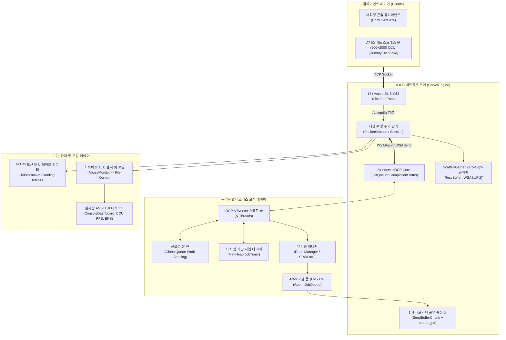

# 🚀 High-Performance C++ IOCP Chat Server & Engine


-success.svg)

> **대규모 동시 접속(10,000 CCU)을 처리하는 Windows IOCP 기반의 고성능 멀티스레드 채팅 서버 엔진 및 애플리케이션 포트폴리오**입니다.  
> 힙 락 경합을 0%로 줄인 **Lock-Free 메모리 풀**, Zero-Copy 분할 수신 **Scatter-Gather 링버퍼**, 1:N 패킷 복사 비용을 없앤 **SendBuffer 청크 공유 모델**, 룸 내부 락을 원천 제거한 **Actor JobQueue**, C# 자동 패킷 생성기, 그리고 실시간 **어뷰징(플러딩/타임아웃) 방어 및 ANSI TUI 관제 시스템**을 포함합니다.

---

## 📑 목차 (Table of Contents)
- [1. 시스템 아키텍처 (Architecture Diagram)](#1-시스템-아키텍처-architecture-diagram)
- [2. 핵심 기술 및 엔지니어링 차별화 포인트](#2-핵심-기술-및-엔지니어링-차별화-포인트)
  - [2.1 메모리 및 버퍼 엔진](#21-메모리-및-버퍼-엔진-memory--buffer-engine)
  - [2.2 멀티스레드 및 동기화 아키텍처](#22-멀티스레드-및-동기화-아키텍처-multi-threading--concurrency)
  - [2.3 비동기 네트워크 I/O 파이프라인](#23-비동기-네트워크-io-파이프라인-network-io-pipeline)
  - [2.4 패킷 제너레이터 자동화 툴체인](#24-패킷-제너레이터-자동화-툴체인-packet-generator)
  - [2.5 보안, 어뷰징 방어 및 실시간 관제 대시보드](#25-보안-어뷰징-방어-및-실시간-관제-대시보드-security--monitoring)
- [3. 더미 클라이언트 스트레스 테스트 및 4대 시나리오](#3-더미-클라이언트-스트레스-테스트-및-4대-시나리오)
- [4. 프로젝트 디렉토리 구조 (Directory Structure)](#4-프로젝트-디렉토리-구조-directory-structure)
- [5. 빌드 및 실행 방법 (Build & Run Guide)](#5-빌드-및-실행-방법-build--run-guide)
- [6. 포트폴리오 기술 요약서 (Portfolio Resume Summary)](#6-포트폴리오-기술-요약서-portfolio-resume-summary)

---

## 1. 시스템 아키텍처 (Architecture Diagram)



---

## 2. 핵심 기술 및 엔지니어링 차별화 포인트

### 2.1 메모리 및 버퍼 엔진 (Memory & Buffer Engine)
* **Windows Lock-Free S-List 기반 `MemoryPool`**:
  * 128비트 하드웨어 CAS(`cmpxchg16b`) 명령어 기반의 `InterlockedPushEntrySList` / `InterlockedPopEntrySList`를 적용하여 ABA 문제를 원천 차단하고 **힙 락 경합을 0%**로 제거.
* **TLS(Thread-Local Storage) Slab Allocator (`PoolAllocator`)**:
  * 32B ~ 4096B까지 13개 Size-Class별 스레드 로컬 캐시를 두어 $O(1)$ 초고속 메모리 할당/해제 달성.
* **Scatter-Gather 2-Span Zero-Copy `RingBuffer` (수신 버퍼)**:
  * 링버퍼 랩어라운드 시 `memmove`로 메모리를 당겨 복사하는 오버헤드를 없애기 위해, 여유 공간을 2개의 `WSABUF` 슬라이스로 분할 전달(`GetWriteSpan`)하여 제로-카피 수신 I/O 달성.
* **SendBufferChunk + Reference Counting (송신 버퍼)**:
  * 1:N 브로드캐스트 시 동일 패킷을 1,000번 `memcpy`하지 않고 **메모리에 딱 1번 직렬화**한 뒤, 스마트 포인터(`std::shared_ptr`) 참조 카운팅으로 1,000개 세션에 공유하여 메모리 복사 비용을 1,000배 절감.

### 2.2 멀티스레드 및 동기화 아키텍처 (Multi-threading & Concurrency)
* **Actor 패턴 `JobQueue` (무락 Room 아키텍처)**:
  * 채팅방 상태 변경 작업을 람다 Job으로 직렬화하여 처리함으로써, **룸 내부 뮤텍스/락을 0개(Lock-Free)**로 설계하여 브로드캐스트 시 락 경합을 완전히 제거.
* **계층별 최적화 락 전략 (Lock Hierarchy)**:
  * **수십 나노초 큐잉**: CPU 파이프라인 과열 방지 `_mm_pause()` 백오프가 적용된 유저 레벨 `SpinLock`.
  * **읽기 집약적 매니저**: Windows 유저 모드 슬림 락(`SRWLOCK`)을 래핑한 `ReadWriteLock`.
  * **보조 작업 절전 풀**: C++ 표준 `std::condition_variable` 결합용 `std::mutex`.
* **Min-Heap `JobTimer`**:
  * 우선순위 큐(Min-Heap)를 통해 타이머 이벤트를 $O(\log N)$으로 관리하고 예약 시간이 도래한 Job을 `JobQueue`에 자동 디스패치.

### 2.3 비동기 네트워크 I/O 파이프라인 (Network I/O Pipeline)
* **16개 풀링 `AcceptEx`**:
  * 사전 생성된 16개의 소켓으로 동시 다발적 대규모 접속 요청(SYN Flood)을 0ms 딜레이로 즉시 수용.
* **비동기 세션 생명주기 안전성 (Zero Dangling Pointer)**:
  * `std::enable_shared_from_this`와 `IocpEvent::owner` 참조 카운팅을 결합하여, 강제 `Disconnect` 시에도 In-Flight 상태인 커널 Overlapped I/O가 모두 완료될 때까지 안전하게 메모리를 보존.

### 2.4 패킷 제너레이터 자동화 툴체인 (Packet Generator)
* **C# .NET 10 기반 `PacketGenerator`**:
  * `PDL.xml` 명세서를 파싱하여 `PacketProtocol.h`, `ServerPacketHandler.h`, `ClientPacketHandler.h`를 원클릭(`GenPackets.bat`) 자동 생성.
* **컴파일 타임 포인터 안전성 보장**:
  * `BufferReader::Read` / `BufferWriter::Write`에 `static_assert(!std::is_pointer_v<T>)`를 강제하여 포인터 주소가 잘못 직렬화되는 인적 실수를 원천 방지.

### 2.5 보안, 어뷰징 방어 및 실시간 관제 대시보드 (Security & Monitoring)
* **원자적 토큰 버킷(`TokenBucket`) 패킷 플러딩 방어**:
  * 세션별로 원자적 토큰을 부여하여 초당 버스트 한도를 초과하는 악의적 패킷 폭주 시 즉시 차단 및 강제 퇴장.
* **하트비트 타임아웃 감시 (`AbuseMonitor`)**:
  * 15초 이상 패킷/하트비트가 없는 무응답 좀비 커넥션(Slowloris)을 감지하여 자동 연결 종료 및 [`Abuse_Disconnect_Log.txt`](file:///c:/Users/ky499/source/repos/ChatServer/Abuse_Disconnect_Log.txt) 파일 덤프.
* **깜빡임 없는 ANSI TUI 실시간 관제 대시보드 (`ConsoleDashboard`)**:
  * 가상 터미널 ANSI 이스케이프 시퀀스(`\033[H`)를 적용하여 화면 깜빡임 없이 1초 주기로 서버 상태(CCU, PPS, RX/TX 대역폭, 활성 룸 수, 최근 5건 제재 테이블)를 실시간 출력.

---

## 3. 더미 클라이언트 스트레스 테스트 및 4대 시나리오

`DummyClient.exe`는 대규모 부하와 악의적인 공격 상황을 시뮬레이션하여 서버의 한계와 방어 기제를 자동 검증합니다:

| 시나리오 번호 | 시나리오 명칭 | 동작 방식 및 검증 목적 |
| :---: | :--- | :--- |
| **[1]** | **Normal Chatting Load Test** | 500~2,000대 봇이 동시 접속하여 로그인, 방 입장, 주기적 채팅 및 하트비트를 송수신하며 서버 처리량(PPS/BPS) 측정 |
| **[2]** | **Slowloris / Idle Timeout Test** | 접속 후 패킷/하트비트를 일체 보내지 않고 세션만 점유 $\rightarrow$ 15초 후 서버 `AbuseMonitor`의 타임아웃 강제 퇴장 검증 |
| **[3]** | **Connect / Disconnect Spam Test** | 연결 직후 10ms 만에 Disconnect를 초고속 반복 $\rightarrow$ 소켓 풀 재활용, 메모리 누수 0% 및 커널 핸들 고갈 방지 검증 |
| **[4]** | **Packet Flooding Attack Test** | 초당 80개 이상의 패킷을 연속 난사 $\rightarrow$ 서버의 `TokenBucket` 레이트 리미터가 즉시 어뷰징 감지 및 강제 차단 검증 |
| **[5]** | **All-in-One Chaos Suite** | 4대 시나리오를 연속 실행하여 복합 스트레스 상황에서의 서버 무결점 안정성 종합 검증 |

```
========================================================================================
               HIGH-PERFORMANCE IOCP CHAT SERVER MONITORING DASHBOARD                   
========================================================================================
 [Server Status] ONLINE | Port: 7777 | Uptime: 00:05:21 | Threads: Worker + Timer
----------------------------------------------------------------------------------------
 [1] Network & User Metrics
  * Current CCU (Active)     :    500 / 10000
  * Total Accepted Conns     :    500
  * Throughput (PPS)         :   1,250 pkts/sec
  * Bandwidth (RX / TX)      :  48.20 KB/s / 241.00 KB/s
----------------------------------------------------------------------------------------
 [2] Chat Rooms & Security Defense
  * Active Chat Rooms (Actor):      5 Rooms
  * Abuse Force Disconnects  :      0 cases (Flooding/Timeout)
----------------------------------------------------------------------------------------
 [3] Recent Abuse & Forced Disconnect Events (Latest 5)
 [Timestamp]          [Session]   [Player]        [Endpoint]            [Reason]
 --------------------------------------------------------------------------------------
  2026-09-01 03:16:20 999         Attacker_User   192.168.1.100:55555   Packet Flooding Detected
========================================================================================
 [Commands] [S] Save Log File | [C] Clear Screen | [Q] Graceful Shutdown
========================================================================================
```

---

## 4. 프로젝트 디렉토리 구조 (Directory Structure)

```
ChatServer/
├── Source/
│   ├── ServerEngine/            # 코어 IOCP 고성능 네트워크 엔진 (정적 라이브러리)
│   │   ├── Buffer/              # RingBuffer(Scatter-Gather), SendBuffer(Zero-Copy Chunk)
│   │   ├── Common/              # Types, Macros, CoreGlobal
│   │   ├── Job/                 # Job, JobQueue(Actor), GlobalQueue, JobTimer(Min-Heap)
│   │   ├── Lock/                # SpinLock(_mm_pause), ReadWriteLock(SRWLOCK)
│   │   ├── Memory/              # MemoryPool(Lock-Free S-List), PoolAllocator(TLS Slab)
│   │   ├── Network/             # IocpCore, Session, PacketSession, Listener(AcceptEx), Service
│   │   ├── Thread/              # ThreadManager, ThreadPool
│   │   └── Utility/             # TokenBucket(Rate Limiter)
│   │
│   ├── ChatServer/              # 채팅 서버 비즈니스 로직 & 관제 애플리케이션
│   │   ├── Room/                # Room(Actor JobQueue), RoomManager
│   │   ├── Session/             # ClientSession (패킷 핸들링, 토큰버킷 연동)
│   │   ├── Service/             # AbuseMonitor (하트비트 타임아웃 감시, 파일 로깅)
│   │   ├── Monitoring/          # ServerStats(원자적 통계), ConsoleDashboard(ANSI TUI)
│   │   ├── Protocol/            # PacketHandlerImpl.cpp
│   │   └── Main.cpp             # 메인 엔트리포인트 및 콘솔 핫키([S], [C], [Q])
│   │
│   ├── ChatClient/              # 대화형 콘솔 클라이언트 애플리케이션
│   │   ├── Session/             # ServerSession
│   │   ├── Protocol/            # ClientPacketHandlerImpl.cpp
│   │   └── Main.cpp             # 대화형 CLI (/login, /list, /join, /global, /flood)
│   │
│   ├── DummyClient/             # 멀티스레드 부하 및 어뷰징 스트레스 테스터
│   │   ├── Session/             # DummySession (4대 시나리오 행동 트리)
│   │   ├── Protocol/            # DummyPacketHandlerImpl.cpp
│   │   ├── StressTester.h/.cpp  # 스트레스 테스트 오케스트레이터 및 실시간 프로그레스 UI
│   │   └── Main.cpp             # 5대 시나리오 선택 메뉴
│   │
│   ├── Common/Protocol/         # 자동 생성된 프로토콜 헤더 (C# PacketGenerator 산출물)
│   │   ├── PacketProtocol.h
│   │   ├── ServerPacketHandler.h
│   │   └── ClientPacketHandler.h
│   │
│   ├── PacketGenerator/         # C# .NET 10 기반 XML(PDL) 패킷 자동 생성기
│   │   ├── PDL.xml              # 패킷 정의 스키마 (Login, Room, Chat, Notice 등)
│   │   └── Program.cs
│   │
│   └── EngineTest/              # 10대 핵심 엔진 서브시스템 단위/통합 테스트 러너
│       └── Main.cpp             # (10/10 Tests Passed with 100% Success)
│
├── CMakeLists.txt               # 통합 CMake 빌드 스크립트
├── GenPackets.bat               # 패킷 자동 생성 배치 스크립트
└── README.md                    # 프로젝트 종합 기술 문서
```

---

## 5. 빌드 및 실행 방법 (Build & Run Guide)

### 요구 사양
* **OS**: Windows 10 / 11 (x64)
* **컴파일러**: Visual Studio 2022 이상 (MSVC v143+, C++17 지원)
* **빌드 툴**: CMake 3.20 이상
* **패킷 제너레이터 실행 환경**: .NET SDK 8.0 이상 (10.0 권장)

### 빌드 명령어 (Visual Studio x64 Developer Command Prompt)
```powershell
# 1. 패킷 코드 생성 (필요 시)
.\GenPackets.bat

# 2. CMake 구성 및 Release 빌드
cmake -B Build -S .
cmake --build Build --config Release
```

### 실행 가이드
```powershell
# [터미널 1] 채팅 서버 실행 (기본 포트 7777 또는 동적 포트 지정)
.\Bin\Release\ChatServer.exe 7777

# [터미널 2] 대화형 클라이언트 실행
.\Bin\Release\ChatClient.exe 127.0.0.1 7777

# [터미널 3] 더미 클라이언트 스트레스 테스터 실행
.\Bin\Release\DummyClient.exe 127.0.0.1 7777

# [터미널 4] 전체 서브시스템 통합 단위 테스트 실행 (10개 테스트 자동 검증)
.\Bin\Release\EngineTest.exe
```

---

## 6. 포트폴리오 기술 요약서 (Portfolio Resume Summary)

### 📌 프로젝트 핵심 역량 3줄 요약
1. **메모리 및 버퍼 최적화**: Lock-Free S-List 메모리 풀, Scatter-Gather Zero-Copy 링버퍼, 1:N 참조 카운팅 SendBuffer 청크를 통해 **힙 락 경합 0% 및 제로 카피 I/O 달성**.
2. **동기화 및 동시성 설계**: Actor 모델 `JobQueue`를 도입하여 **채팅 룸 내부 락을 0개(Lock-Free)로 제거**하고, 유저 레벨 `SpinLock`(`_mm_pause`)과 `SRWLOCK`을 적재적소에 계층화.
3. **네트워크 및 안정성**: 16개 `AcceptEx` 풀링, C# .NET 10 패킷 자동화 툴체인, 원자적 `TokenBucket` 레이트 리미터 및 15초 하트비트 감시를 갖춘 실시간 ANSI TUI 관제 시스템 구축.
